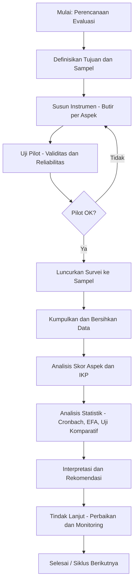
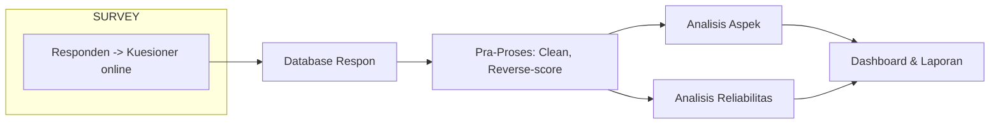

# Metode Evaluasi: *User Satisfaction Survey*

*(Mengukur tingkat kepuasan pengguna sistem — aspek: Kecepatan, Akurasi, Kemudahan, Tampilan, Dukungan)*

---

> Dokumen ini disusun dalam format Markdown siap-upload ke GitHub. Terdapat definisi, panduan pemanfaatan, prosedur dan persyaratan, diagram alur (Mermaid aktif), instrumen kuesioner contoh, metode pengolahan dan penghitungan indeks kepuasan, contoh tabel data, analisis statistik dasar, serta kesimpulan. Semua bagian dijelaskan secara rinci agar langsung bisa dipakai sebagai referensi penelitian atau lampiran skripsi.

---

# 1. Pengertian

**User Satisfaction Survey (Survei Kepuasan Pengguna)** adalah metode kuantitatif untuk mengukur persepsi pengguna terhadap suatu sistem informasi/perangkat lunak berdasarkan dimensi-dimensi pengalaman penggunaan nyata (mis. kecepatan, akurasi, kemudahan, tampilan, dukungan). Survei ini biasanya menggunakan kuesioner dengan skala Likert (mis. 5 poin) sehingga respons dapat diubah menjadi skor numerik dan dianalisis secara kuantitatif. Pendekatan ini konsisten dengan model kualitas perangkat lunak dan kualitas penggunaan yang direkomendasikan standar internasional, dan juga sejalan dengan model kesuksesan sistem informasi yang menempatkan kepuasan pengguna sebagai variabel sentral. ([cdn.standards.iteh.ai][1])

**Mengapa penting?**

* Kepuasan pengguna adalah indikator langsung apakah sistem memenuhi kebutuhan fungsional dan non-fungsional (mis. kecepatan dan kemudahan).
* Hasil survei membantu pengembang / tim produk memprioritaskan perbaikan fitur, peningkatan performa, dan dukungan pengguna.
* Dalam penelitian akademik/skripsi, indeks kepuasan berfungsi sebagai variabel terikat (dependent variable) yang mudah dioperasionalisasikan. ([cdn.standards.iteh.ai][1])

---

# 2. Bagaimana Pemanfaatannya (Ruang Lingkup & Kegunaan)

1. **Evaluasi Pasca-Rilis / Pasca-Implementasi**

   * Mengukur tingkat kepuasan setelah update besar atau setelah sistem dipakai oleh pengguna target selama periode tertentu.

2. **Benchmarking & Prioritisasi Perbaikan**

   * Menentukan aspek mana (kecepatan, akurasi, kemudahan, tampilan, dukungan) yang paling bermasalah sehingga sumber daya perbaikan dialokasikan secara efisien.

3. **Umpan Balik Berkelanjutan untuk Siklus Pengembangan (CI/CD)**

   * Menjadi input untuk backlog perbaikan, validasi perbaikan, dan pengukuran tren kepuasan dari waktu ke waktu.

4. **Penelitian Akademik**

   * Digunakan sebagai instrumen untuk menguji hipotesis tentang hubungan antara kualitas sistem (mis. ISO/IEC 25010) dan kepuasan pengguna. ([cdn.standards.iteh.ai][1])

---

# 3. Prosedur dan Persyaratan Penggunaan

## 3.1 Persyaratan Awal

* **Populasi dan Sampel**: Definisikan pengguna target (mis. pengguna internal, pelanggan, mahasiswa). Tentukan teknik sampling (acak sederhana, stratified, convenience) dan hitung ukuran sampel yang memadai (rumus proporsi atau menggunakan aturan praktis n ≥ 30 untuk analisis dasar).
* **Periode Pengukuran**: Minimal satu siklus penggunaan (mis. 2–4 minggu penggunaan aktif) agar pengguna cukup pengalaman.
* **Akses & Izin**: Pastikan izin data (ethics/informed consent) jika data sensitif atau jika survei dilakukan untuk penelitian.
* **Media Pengumpulan**: Online (Google Forms, LimeSurvey, Qualtrics) atau kertas. Disarankan online untuk efisiensi dan integrasi data.

## 3.2 Langkah Prosedural
1. **Perencanaan Instrumen**: Susun butir kuesioner berdasarkan aspek (kecepatan, akurasi, kemudahan, tampilan, dukungan). Gunakan 4–6 butir per aspek bila ingin reliabilitas lebih tinggi.
2. **Uji Validitas & Reliabilitas Awal**: Lakukan uji coba (pilot) pada 15–30 responden untuk cek konsistensi (Cronbach’s α) dan revisi butir yang ambigu. ([PMC][2])
3. **Pelaksanaan Survei**: Sebarkan kuesioner ke sampel utama. Pastikan pengumpulan data minimal memenuhi ukuran sampel per rancangan.
4. **Pengolahan Data**: Entri data → bersihkan → analisis skor item, skor aspek, indeks kepuasan.
5. **Pelaporan & Tindak Lanjut**: Buat laporan ringkas dan rekomendasi prioritas per aspek.

## 3.3 Bentuk Kuesioner

* Gunakan skala Likert 5 poin: 1 = Sangat Tidak Setuju hingga 5 = Sangat Setuju. (Atau 1–5 dengan label yang sesuai). Rensis Likert merekomendasikan format ini sejak 1932. ([legacy.voteview.com][3])
* Kombinasikan pertanyaan afirmatif dan — jika perlu — negatif (diberi skor terbalik) untuk mengurangi bias respons otomatis.
* Sertakan metadata responden (umur, pengalaman penggunaan, frekuensi penggunaan) untuk analisis segmentasi.

---

# 4. Instrumen — Contoh Kuesioner (Kompilasi Butir per Aspek)

> Gunakan tabel ini sebagai template yang dapat disalin langsung ke Google Forms atau alat survei lain.

| No. | Butir Pertanyaan (Afirmasi)                                     | Aspek     |
| --: | --------------------------------------------------------------- | --------- |
|   1 | Aplikasi memuat halaman dengan cepat saat saya membukanya.      | Kecepatan |
|   2 | Respon sistem terhadap perintah saya selalu cepat.              | Kecepatan |
|   3 | Hasil yang diberikan oleh sistem akurat dan sesuai harapan.     | Akurasi   |
|   4 | Sistem jarang menampilkan informasi yang salah.                 | Akurasi   |
|   5 | Antarmuka sistem mudah dipahami bahkan pada penggunaan pertama. | Kemudahan |
|   6 | Menu dan navigasi sistem logis dan konsisten.                   | Kemudahan |
|   7 | Tampilan sistem menarik dan tata letaknya mendukung penggunaan. | Tampilan  |
|   8 | Warna, tipografi, dan ikon memudahkan memahami fungsi.          | Tampilan  |
|   9 | Tim dukungan merespon cepat jika saya melaporkan masalah.       | Dukungan  |
|  10 | Dokumentasi / help system membantu memecahkan masalah saya.     | Dukungan  |

Skala: 1 (Sangat Tidak Setuju) — 5 (Sangat Setuju).

> Catatan: Minimal 2 butir per aspek; ideal 3–6 butir/ aspek untuk reliabilitas yang baik.

---

# 5. Pengolahan Data & Perhitungan Indeks Kepuasan Pengguna

## 5.1 Pra-pengolahan

* **Pembersihan**: Hapus respon tidak lengkap (>50% missing) atau yang jelas invalid.
* **Skor Terbalik**: Untuk butir negatif, lakukan transformasi: skor_baru = (max + 1) − skor_lama. (dengan max=5 untuk skala 1–5).

## 5.2 Perhitungan Skor Aspek

Untuk setiap aspek (mis. Kecepatan) hitung:

* `Skor_Aspek = (Σ skor_butir_aspek) / (Jumlah_butir_aspek × Maks_skor)` → menghasilkan nilai proporsi (0–1)
* Atau hitung rata-rata: `Rata2_Aspek = (Σ skor_butir_aspek) / (Jumlah_butir_aspek)`, rentang 1–5.

## 5.3 Indeks Kepuasan Pengguna (IKP) — Contoh Formula (Skala 0–100)

* Pilihan formula populer: konversi rata-rata keseluruhan ke skala 0–100.

  1. Hitung `Rata2_Total = (Σ semua jawaban) / (Jumlah_total_butir)` → rentang 1–5.
  2. Konversi: `IKP = (Rata2_Total - 1) / (5 - 1) × 100` → rentang 0–100.

Contoh interpretasi (aturan praktis):

* 0–20: Sangat Tidak Puas
* 21–40: Tidak Puas
* 41–60: Cukup / Netral
* 61–80: Puas
* 81–100: Sangat Puas

> Interpretasi harus dikalibrasi terhadap konteks organisasi dan benchmark historis. Susunan ambang dapat dimodifikasi bergantung kebutuhan penelitian.

## 5.4 Perhitungan Contoh (angka sederhana)

Misalkan 10 butir, seorang responden total skor = 38 → `Rata2_Total = 3.8` → `IKP = (3.8−1)/4 ×100 = 70%` → kategori: Puas.

---

# 6. Contoh Tabel Data dan Ringkasan Hasil (Markdown)

## 6.1 Contoh Data Respon Mentah (format CSV/TSV mudah diekspor)

| Responden | Kecepatan_1 | Kecepatan_2 | Akurasi_1 | Akurasi_2 | Kemudahan_1 | Kemudahan_2 | Tampilan_1 | Tampilan_2 | Dukungan_1 | Dukungan_2 |
| --------: | ----------: | ----------: | --------: | --------: | ----------: | ----------: | ---------: | ---------: | ---------: | ---------: |
|       R01 |           4 |           4 |         5 |         4 |           3 |           3 |          4 |          4 |          3 |          2 |
|       R02 |           3 |           3 |         3 |         3 |           4 |           4 |          3 |          3 |          4 |          4 |
|       R03 |           5 |           5 |         5 |         5 |           5 |           4 |          5 |          5 |          5 |          5 |

## 6.2 Tabel Rangkuman Per Aspek (setelah agregasi)

| Aspek           | Jumlah Butir | Rata-rata Aspek (1–5) | Konversi (0–100) |
| --------------- | -----------: | --------------------: | ---------------: |
| Kecepatan       |            2 |                   4.0 |               75 |
| Akurasi         |            2 |                   4.3 |             82.5 |
| Kemudahan       |            2 |                   4.0 |               75 |
| Tampilan        |            2 |                   4.0 |               75 |
| Dukungan        |            2 |                   3.7 |             67.5 |
| **Total (IKP)** |           10 |                   4.0 |               75 |

> Tabel di atas memberi gambaran ringkas bidang mana yang perlu difokuskan (mis. Dukungan terendah → prioritas perbaikan).

---

# 7. Analisis Statistik & Validitas

## 7.1 Reliabilitas (Konsistensi Internal)

* **Cronbach’s Alpha**: hitung Cronbach’s α untuk setiap aspek (dengan ≥0.70 dianggap dapat diterima untuk studi eksploratori; ≥0.80 untuk studi yang lebih ketat). Uji ini mengukur konsistensi internal butir-butir yang mengukur konstruk yang sama. ([PMC][2])

## 7.2 Validitas

* **Validitas Isi**: pastikan butir mewakili ruang lingkup aspek (minta panel ahli untuk menskor relevansi butir).
* **Validitas Konstruk**: lakukan analisis faktor eksploratori (EFA) untuk memeriksa apakah butir-butir memang mengelompok sesuai aspek yang dimaksud. Jika sampel besar, lakukan konfirmasi (CFA).

## 7.3 Uji Statistik Lainnya

* **Uji Perbandingan**: t-test atau ANOVA untuk membandingkan IKP antar kelompok (mis. pengguna baru vs berpengalaman).
* **Korelasi / Regresi**: jika ingin melihat pengaruh aspek (predictor) terhadap kepuasan keseluruhan (dependent variable), gunakan regresi linier berganda—namun cek asumsi (normalitas residual, multikolinearitas).
* **Analisis Tren**: jika survei dilakukan berkali-kali, gunakan analisis deret waktu sederhana atau uji tren.

> Untuk analisis Likert sebagai data ordinal vs interval: pendekatan umum (dengan dukungan literatur) memperlakukan skala Likert gabungan (rata-rata item) sebagai data interval untuk keperluan agregasi dan statistik parametrik, namun peneliti harus menjustifikasi pilihan metode dan memeriksa asumsi distribusi. ([PMC][2])

---

# 8. Diagram Alur

## 8.1 Alur Proses Evaluasi — Flowchart

## 8.2 Data Flow

---

# 9. Contoh Visualisasi Ringkas (saran implementasi)

* **Grafik batang per aspek** (rata-rata skornya) untuk melihat perbandingan.
* **Radar chart** untuk representasi profil kualitas (kecepatan, akurasi, kemudahan, tampilan, dukungan).
* **Heatmap** untuk melihat korelasi antar butir (mendeteksi butir redundan).

> Catatan teknis: untuk repository GitHub, gunakan script Python/R (mis. pandas, matplotlib, seaborn) atau library JS (Chart.js, D3) untuk render grafik. Jika ingin tampilan dokumentasi statis, sertakan gambar PNG di folder `assets/` dan referensikan di README/MD.

---

# 10. Contoh Lembar Analisis: Cara Melaporkan Hasil

**Ringkasan Eksekutif (2–3 kalimat)**
Contoh: "Berdasarkan survei pada N = 120 pengguna selama periode 1 bulan, Indeks Kepuasan Pengguna (IKP) sistem sebesar 72 (kategori: Puas). Aspek dukungan menunjukkan skor terendah (67.5) dan direkomendasikan prioritas perbaikan."

**Detail Hasil per Aspek (tabel + interpretasi singkat)**

* Berikan rata-rata, standar deviasi, dan nilai Cronbach α untuk setiap aspek.
* Laporkan butir-butir yang memiliki skor rata-rata ≤ 3 sebagai fokus perbaikan.

**Rekomendasi**

* Perbaikan dokumentasi & SLA dukungan.
* Optimasi query/database untuk meningkatkan kecepatan halaman tertentu.
* Uji A/B pada perubahan tampilan jika tampilan mendapat skor sedang.

---

# 11. Catatan Metodologis & Keterbatasan

1. **Bias Respon**: Survei self-report rentan terhadap social desirability dan non-response bias; mitigasi dengan anonimitas dan reminder.
2. **Skala Likert**: Walau umum digunakan, interpretasi statistik parametrik pada data Likert harus dipertimbangkan (lihat literatur analisis Likert). ([PMC][2])
3. **Generalisasi**: Hasil berlaku untuk populasi yang sama dengan sampel; jangan langsung gegabah menggeneralisir ke populasi berbeda tanpa verifikasi.

---

# 12. Referensi

* ISO/IEC 25010:2011 — *Systems and software engineering — System and software quality models*. ([cdn.standards.iteh.ai][1])
* DeLone, W. H., & McLean, E. R. (2003). *The DeLone and McLean Model of Information Systems Success: A Ten-Year Update*. Journal of Management Information Systems. ([tandfonline.com][4])
* Likert, R. (1932). *A Technique for the Measurement of Attitudes.* (Asal-usul skala Likert). ([legacy.voteview.com][3])
* Brooke, J. (1996). *SUS — A “Quick and Dirty” Usability Scale.* (referensi untuk ukuran usability sederhana). ([ResearchGate][5])
* Sullivan, G. M., & Artino, A. R. (2013). *Analyzing and Interpreting Data From Likert-Type Scales.* (panduan analisis statistik Likert). ([PMC][2])

> Jika Anda membutuhkan daftar pustaka lengkap dalam format APA 7th (dengan DOI/link), saya bisa tambahkan file `references.bib` atau daftar referensi tertata untuk dimasukkan ke skripsi.

---

# 13. Kesimpulan

Metode *User Satisfaction Survey* dengan kuesioner skala Likert adalah metode praktis, terukur, dan cocok untuk penelitian skripsi dan praktik pengembangan produk. Dengan perencanaan instrumen yang matang, uji pilot untuk validitas dan reliabilitas, serta prosedur pengolahan data yang jelas (termasuk konversi ke Indeks Kepuasan Pengguna 0–100), tim pengembang dan peneliti dapat memperoleh gambaran kuantitatif tentang performa sistem menurut perspektif pengguna. Hasil survei tidak hanya memberi ukuran statis; apabila dilaksanakan secara periodik, survei ini menjadi alat monitoring yang kuat untuk siklus perbaikan berkelanjutan.

---

