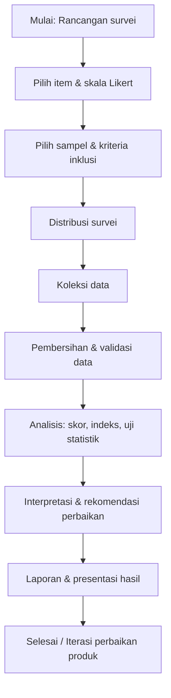
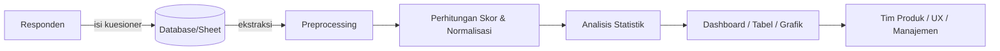

# Metode Evaluasi: **User Satisfaction Survey**

> Tujuan: Mengukur tingkat kepuasan pengguna sistem
> Fokus Aspek: Kecepatan, Akurasi, Kemudahan, Tampilan, Dukungan
> Instrumen: Kuesioner skala Likert (1–5)
> Output: Indeks Kepuasan Pengguna (angka / skor dan kategori interpretasi)

---

## 1. Pengertian (Definition)

**User Satisfaction Survey** adalah metode evaluasi subjektif yang menggunakan instrumen kuesioner untuk mengukur persepsi dan kepuasan pengguna terhadap suatu sistem, produk, atau layanan. Metode ini mengkuantifikasi pengalaman pengguna (user experience) pada dimensi-dimensi seperti kecepatan, akurasi, kemudahan pemakaian, estetika tampilan, dan dukungan teknis atau layanan purna-jual. Penggunaan skala Likert yang distandarisasi memudahkan agregasi jawaban menjadi indeks kepuasan yang dapat dibandingkan antar-versi, antar-grup pengguna, atau antar-waktu pengukuran. ([legacy.voteview.com][1])

---

## 2. Bagaimana Pemanfaatannya (Utilization / Use Cases)

User Satisfaction Survey digunakan dalam beberapa konteks berikut (setiap poin disertai contoh praktis):

1. **Evaluasi pasca-rilis**: Setelah fitur baru dirilis, survei cepat untuk mengetahui apakah pengguna merasakan peningkatan kecepatan atau kemudahan.
2. **Perbandingan desain (A/B testing)**: Menilai preferensi pengguna terhadap dua versi UI berbeda (mis. tampilan lama vs baru).
3. **Pemantauan kualitas layanan (SLA / Support)**: Menilai kepuasan terhadap respon tim dukungan (helpdesk).
4. **Riset pengguna untuk roadmap produk**: Memprioritaskan perbaikan berdasarkan aspek yang paling menurunkan kepuasan.
5. **Pengukuran longitudinal**: Mengukur perubahan kepuasan dari waktu ke waktu (trend).

Secara metodologis, pengukuran kepuasan termasuk bagian dari praktik usability dan user experience yang direkomendasikan di standar-standar ergonomi/usability dan literatur kuantifikasi pengalaman pengguna. Penggabungan pengukuran subjektif (survei) dan objektif (waktu tugas, error rate) menghasilkan gambaran yang lebih lengkap. ([cdn.standards.iteh.ai][2])

---

## 3. Prosedur dan Persyaratan Penggunaan (Procedure & Requirements)

### 3.1 Persiapan Instrumen

* **Item (Pertanyaan)**: Sediakan pertanyaan yang menilai setiap aspek: Kecepatan, Akurasi, Kemudahan, Tampilan, Dukungan.
* **Skala**: Likert 5-point (1 = Sangat Tidak Puas / Sangat Tidak Setuju, 5 = Sangat Puas / Sangat Setuju).
* **Jumlah item**: Minimal 1–2 item per aspek; ideal 8–15 item total agar tidak melelahkan responden.
* **Bahasa dan Pelaporan**: Gunakan bahasa yang jelas dan periksa terjemahan bila survei lintas-bahasa.

### 3.2 Sampel dan Rekrutmen

* **Ukuran sampel**: Tergantung tujuan — uji internal minimal 30 responden untuk analisis deskriptif; studi komparatif/hipotesis biasanya membutuhkan lebih banyak (lihat kalkulasi power).
* **Teknik sampling**: Random sampling di antara pengguna aktif, stratified sampling bila ingin perbandingan demografis (mis. pemula vs mahir).
* **Kriteria inklusi**: Pengguna aktif dalam periode tertentu (mis. 1 bulan terakhir), telah melakukan minimal N sesi/tugas pada sistem.
* **Etika & Persetujuan**: Berikan informed consent ringkas: tujuan survei, kebijakan anonim/identitas, penggunaan data.

### 3.3 Pelaksanaan Survei

1. **Distribusi**: Web-based form (Google Forms, Typeform, platform internal) atau inline di aplikasi.
2. **Waktu pengisian**: Usahakan ≤ 5 menit.
3. **Pengingat**: Kirim 1–2 pengingat jika response rate rendah (etika: jangan spam).
4. **Catatan Open-Ended**: Sertakan 1-2 kolom komentar terbuka untuk insight kualitatif.

### 3.4 Pengolahan dan Analisis Data

* **Validasi & Pembersihan**: Hapus respon kosong / tidak valid; cek outliers (respon yang diisi sangat cepat).
* **Skoring**: Konversi nilai Likert tiap item ke skor numerik (1–5). Rata-rata atau agregasi tertimbang per aspek.
* **Normalisasi**: Untuk menghasilkan **Indeks Kepuasan** dapat dinormalisasi ke skala 0–100 menggunakan rumus standar (lihat bagian 4).
* **Uji statistik**: Jika membandingkan grup gunakan t-test/Mann-Whitney untuk dua grup, ANOVA/Kruskal-Wallis untuk >2 grup, atau uji paired untuk sebelum-sesudah. Gunakan juga analisis reliabilitas (Cronbach’s α) untuk memastikan konsistensi internal skala. Referensi metodologi statistik tersedia di literatur kuantifikasi pengalaman pengguna. ([ndl.ethernet.edu.et][3])

---

## 4. Desain Kuesioner: Contoh Isi & Template

### 4.1 Contoh Pertanyaan (Likert 1–5)

| Kode | Aspek         | Pernyataan (Isi kuesioner)                                                 |
| ---- | ------------- | -------------------------------------------------------------------------- |
| Q1   | Kecepatan     | “Sistem merespon dengan cepat saat saya melakukan tugas utama.”            |
| Q2   | Akurasi       | “Hasil yang diberikan sistem sesuai dengan yang saya harapkan / akurat.”   |
| Q3   | Kemudahan     | “Saya menemukan sistem mudah digunakan untuk menyelesaikan tugas saya.”    |
| Q4   | Tampilan      | “Tampilan antarmuka (UI) sistem menarik dan mudah dipahami.”               |
| Q5   | Dukungan      | “Dukungan teknis dan dokumentasi membantu saya ketika menghadapi masalah.” |
| Q6   | Kepuasan Umum | “Secara keseluruhan, saya puas menggunakan sistem ini.”                    |

> Semua pertanyaan diberi skala 1–5 (1 = Sangat Tidak Puas / Sangat Tidak Setuju; 5 = Sangat Puas / Sangat Setuju).

### 4.2 Contoh Kuesioner dalam Markdown (Form-ready)

```markdown
1. Q1 - Kecepatan: [1] [2] [3] [4] [5]
2. Q2 - Akurasi:   [1] [2] [3] [4] [5]
3. Q3 - Kemudahan: [1] [2] [3] [4] [5]
4. Q4 - Tampilan:  [1] [2] [3] [4] [5]
5. Q5 - Dukungan:  [1] [2] [3] [4] [5]
6. Q6 - Kepuasan Umum: [1] [2] [3] [4] [5]
Komentar tambahan (opsional): ______________________________________
```

---

## 5. Skema Penghitungan Indeks Kepuasan (Step-by-step)

### 5.1 Penghitungan dasar (cara sederhana)

1. **Hitung skor rangkap per responden**: Jumlahkan nilai semua item (contoh: 6 item, masing-masing 1–5 → rentang total = 6–30).
2. **Normalisasi ke skala 0–100**:

   * Ambil `SkorRaw` = jumlah nilai item (misalnya 21).
   * Hitung `MinRaw` = jumlah minimum item (6), `MaxRaw` = jumlah maksimum item (30).
   * Rumus normalisasi:

     ```
     Indeks = (SkorRaw - MinRaw) / (MaxRaw - MinRaw) * 100
     ```
   * Contoh numerik:

     * SkorRaw = 21
     * Indeks = (21 - 6) / (30 - 6) * 100 = 15 / 24 * 100 = 62.5
       (Langkah penghitungan dilakukan digit-by-digit untuk menghindari kesalahan: 21-6=15; 30-6=24; 15/24=0.625; 0.625*100=62.5)

### 5.2 Penghitungan per-aspek (bobot sama)

* Jika setiap aspek memiliki 1 item, indeks aspek = normalisasi pada rentang item tunggal (1–5) → `((nilai-1)/(5-1))*100`.
* Jika aspek memiliki banyak item, jumlahkan nilai item-aspek lalu normalisasi sesuai rentang jumlah item-aspek.

### 5.3 Penghitungan tertimbang (opsional)

* Jika ingin memberi bobot berbeda (mis. kecepatan lebih penting), tetapkan bobot w_i untuk setiap aspek (∑w_i = 1), hitung skor aspek masing-masing, lalu:

  ```
  Indeks_Tertimbang = Σ (w_i * Indeks_Aspek_i)
  ```

### 5.4 Kategori Interpretasi (contoh)

| Indeks (0–100) | Kategori          |
| -------------- | ----------------- |
| 0–20           | Sangat Tidak Puas |
| 21–40          | Tidak Puas        |
| 41–60          | Cukup             |
| 61–80          | Puas              |
| 81–100         | Sangat Puas       |

---

## 6. Validitas & Reliabilitas

* **Reliabilitas**: Hitung Cronbach’s α pada dataset item untuk mengecek konsistensi internal; α ≥ 0.7 umumnya dapat diterima.
* **Validitas isi**: Minta ahli domain/UX review pertanyaan (content validity).
* **Validitas konstruk**: Analisis faktor eksploratori (EFA) untuk melihat apakah item berkumpul sesuai aspek teoretis (kecepatan, akurasi, dll.).
* **Bias respons**: Awasi efek sosial-desirability, *acquiescence bias* (kecenderungan setuju) — gunakan item reversely-coded bila perlu.

(Prinsip-prinsip pengukuran dan statistik praktis untuk UX dapat ditemukan di literatur kuantifikasi pengalaman pengguna). ([ndl.ethernet.edu.et][3])

---

## 7. Visualisasi Hasil — Tabel & Diagram

### 7.1 Tabel output contoh (per-responden — ringkasan)

| Respondent ID | Q1 | Q2 | Q3 | Q4 | Q5 | Q6 | SkorRaw | Indeks (0–100) | Kategori    |
| ------------- | -: | -: | -: | -: | -: | -: | ------: | -------------: | ----------- |
| R-001         |  4 |  4 |  3 |  4 |  3 |  4 |      22 |           66.7 | Puas        |
| R-002         |  5 |  5 |  4 |  4 |  5 |  5 |      28 |           95.8 | Sangat Puas |
| R-003         |  2 |  3 |  2 |  2 |  2 |  2 |      13 |           29.2 | Tidak Puas  |

> *Catatan*: Indeks dihitung dengan rumus normalisasi pada 6 item (MinRaw=6, MaxRaw=30). Contoh angka: R-001 → (22-6)/24*100 = 16/24*100 = 66.666...

### 7.2 Tabel ringkasan per-aspek (rata-rata)

| Aspek     | Jumlah Item | Mean Skor (1–5) | Indeks Aspek (0–100) |
| --------- | ----------: | --------------: | -------------------: |
| Kecepatan |           1 |             4.2 |                73.33 |
| Akurasi   |           1 |             4.0 |                66.67 |
| Kemudahan |           1 |             3.8 |                60.00 |
| Tampilan  |           1 |             4.1 |                70.00 |
| Dukungan  |           1 |             3.6 |                53.33 |

### 7.3 Diagram alir proses pengukuran (Mermaid flowchart)



### 7.4 Diagram dataflow: dari responden ke indeks & dashboard (Mermaid)



---

## 8. Contoh Laporan Hasil (Format Siap Presentasi / GitHub)

### 8.1 Ringkasan eksekutif

* **Sampel**: 120 responden aktif (kriteria: login ≥ 3 kali/bulan).
* **Indeks Kepuasan Rata-rata**: 71.4 (Kategori: Puas).
* **Aspek terendah**: Dukungan (Indeks 54.1) → rekomendasi: perbaiki SLA support & dokumentasi.
* **Aspek tertinggi**: Kecepatan (Indeks 78.2) → sudah baik tetapi masih ada ruang optimasi.

### 8.2 Rekomendasi cepat

1. Tingkatkan dokumentasi self-help dan FAQ.
2. Tambah kanal dukungan (chatbot FAQ + eskalasi ke teknisi).
3. A/B test perubahan antarmuka (tampilan) yang diusulkan pada 20% pengguna.

---

## 9. Alur Diagram Lengkap (Mermaid — Kombinasi Kuantitatif & Kualitatif)

```mermaid
flowchart TB
  subgraph DesignPhase
    A1[Rancangan kuesioner] --> A2[Review ahli]
    A2 --> A3[Pilot test (N=15-30)]
    A3 --> A4[Refine item]
  end

  subgraph DataCollection
    B1[Distribusi - Web form] --> B2[Responden mengisi]
    B2 --> B3[Monitoring response rate]
  end

  subgraph Analysis
    C1[Cleaning & Validasi] --> C2[Descriptive stats]
    C2 --> C3[Reliability (Cronbach's α)]
    C3 --> C4[Inferential tests (t/ANOVA)]
    C4 --> C5[Qualitative coding komentar]
  end

  subgraph Delivery
    D1[Dashboard & Tabel] --> D2[Laporan PDF / MD]
    D2 --> D3[Presentasi untuk stakeholder]
  end

  A4 --> B1
  B3 --> C1
  C5 --> D1
```

---

## 10. Contoh Template Markdown File untuk GitHub (Siap Upload)

> (Anda dapat menyalin seluruh dokumen ini ke file `user-satisfaction-survey.md` dan push ke repo GitHub.)

> *Catatan teknis*: GitHub Markdown merender diagram Mermaid jika opsi diaktifkan pada repo. Jika tidak muncul, aktifkan "Allow-mermaid" atau gunakan screenshot diagram.

---

## 11. Kesimpulan

1. **User Satisfaction Survey** adalah alat terjangkau, cepat, dan berstandar untuk mengukur kepuasan pengguna pada aspek-aspek kunci (kecepatan, akurasi, kemudahan, tampilan, dukungan). Pengukuran subjektif ini paling berguna bila dikombinasikan dengan metrik objektif operasional. ([cdn.standards.iteh.ai][2])
2. **Desain instrumen** harus ringkas, valid, dan reliabel; minimal ada 1 item per-aspek, idealnya disertai item global untuk kepuasan umum. Penghitungan indeks menggunakan normalisasi ke skala 0–100 mempermudah interpretasi. ([legacy.voteview.com][1])
3. **Analisis** harus meliputi pemeriksaan reliabilitas (Cronbach’s α), analisis deskriptif, serta uji perbedaan/group jika perlu. Hasil survei harus diterjemahkan menjadi rekomendasi produk yang dapat diukur (actionable). ([ndl.ethernet.edu.et][3])

---

## 12. Lampiran: Referensi (Pilihan untuk Bacaan Lanjutan — format APA 7th)

> Referensi inti yang direkomendasikan untuk mendasari metodologi ini:

* Likert, R. (1932). *A technique for the measurement of attitudes*. Archives of Psychology, 22(140), 1–55. ([legacy.voteview.com][1])
* Brooke, J. (1996). *SUS: A "quick and dirty" usability scale.* In P. W. Jordan, B. Thomas, B. A. Weerdmeester, & A. L. McClelland (Eds.), *Usability evaluation in industry* (pp. 189–194). (Catatan: esai asli tersedia sebagai PDF publik). ([digital.ahrq.gov][4])
* International Organization for Standardization. (1998). *ISO 9241-11: Ergonomic requirements for office work with visual display terminals (VDTs) — Part 11: Guidance on usability.* (Guidance on usability concepts dan pengukuran). ([cdn.standards.iteh.ai][2])
* Sauro, J., & Lewis, J. R. (2016). *Quantifying the user experience: Practical statistics for user research* (2nd ed.). Morgan Kaufmann. (Panduan praktis statistik untuk UX/US). ([ndl.ethernet.edu.et][3])
* Nielsen, J. (1993). *Usability Engineering.* Morgan Kaufmann. (Buku klasik metode evaluasi usability). ([books.google.com.vc][5])

---
